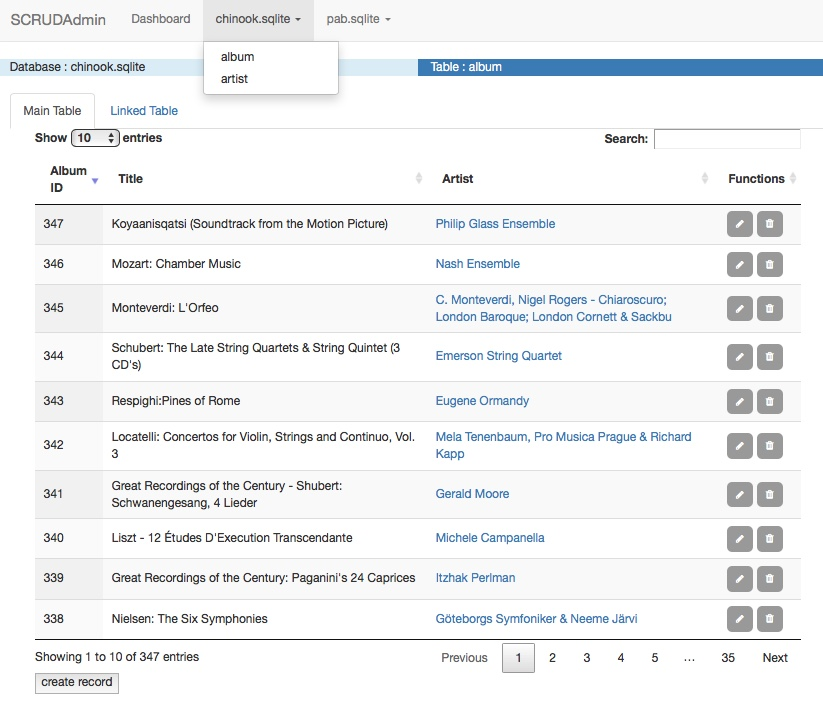

# SCRUD Blueprint

## Purpose :
Display any table in a database as a DataTables.net table.  The webapp will automatically create a dropdown menu with a link to each table.

The user can specify the table design and form design using only python code.  For most cases the javascript, jQuery, html and css files in the app/scrud/ directory can be used as-is.

When the dropdown link to a database table is clicked, the table is displayed with filtering and sorting capabilities provided by DataTables.  Links to related tables are provided in each table row that has a column defined by a foreign key.  Each row has buttons to edit or delete the row and each table has a create new record button.

Computed columns can also be displayed in the table.  These columns are not in the database tables but are computed from database values.  Computed column algorithms are defined in the python models.

Database table image :

## To run :
~~~
$ ./run.sh
~~~

or manually enter the commands :
~~~
    #!/bin/bash
    export FLASK_APP="app:create_app('development')"
    export FLASK_ENV=development
    flask run
~~~

## Platform

Python 3.7, Flask, SQLAlchemy, WTForms, jQuery, Bootstrap 3.3.7, DataTables, sqlite (for the examples in this blueprint), MacOS

The example sqlite database implements the Album and Artist tables from the Chinook database (models_chinook.py) and a custom database (models_pab.py). I entered the models_pab database as an example of using multiple databases.  The company table in models_pab also shows how to implement database columns whose values are computed from other database column values.

## Capabilities

Search, create, read, update and delete records in one or more databases.

## Tutorial

The webapp example includes two main directories: dashboard and scrud. The scrud directory contains all of the code for the scrud blueprint and can be used as-is.  The dashboard directory contains the code to implement a minimalist dashboard as a placeholder to demonstrate how the scrud blueprint fits into a bigger app.  The dashboard includes a menu link to the scrud database page. It also includes links to a demo table and demo form \*.

SQLAlchemy is used for database operations.  In Flask, `db` is the SQLAlchemy instance. Database table models are python classes derived from `db.Model`. The scrud blueprint defines its models using the normal Flask-SQLAlchemy constructs. The scrud blueprint then adds two OrderedDict's to each table model (class). One OrderedDict defines the layout of the table. The other defines the form layout that is presented to the user when the 'create record' button is clicked.

\* The demo table and form use the simplest constructs possible to demonstrate the request and response workflow that could be used for a dashboard outside of the scrud framework. They are here only as examples of a bigger framework and are not integral to the scrud implementation.  The demo table uses data hardwired into the python code, not database data.

### DataTable layout:
The columns displayed in a table can be all, a subset or a superset of the columns in the database table.  The columns displayed are controlled by entries in the `dt_column_spec` OrderedDict. `dt_column_spec` has an item for each database table column to be displayed on the webpage. The column item defines the column title, simple display rendering, whether it is a link to another table, and/or if sorting should be done on this column.

Computed columns show values that are not in the database table, but are computed from columns in the database table. These columns are defined by overriding `def set_computed_columns(self)` with a user specified function that computes the display value for that column.

Examples of the various table display options are shown in the models_pab.py file.  See notes at top of models_pab.py for a detailed description of the dt_column_spec dictionary options.

### Form layout:
When the user clicks the 'create_record' button or 'update record' link, scrud displays a form with input fields for the record.  The form layout is defined in the model class for that table in the `form_spec` OrderedDict.

The `form_spec` specifies the form input label, input type, and other input parameters like placeholder and/or default value. Examples of the available form input types are shown in the models_pab.py file. See notes at top of models_pab.py for a detailed description of the form_spec dictionary options.

## Workflow to add a new table

1. Add table class to model.py
2. Add form class to form.py
3. Migrate database

## Example : Add table 'pet' to models_pab.py

The latest version on github includes the pet table in the database. This is a description of how that table was added to the prior database that did not have the pet table.

Add a table named 'pet' to the database.  It will have columns for name, animal, owner, weight (lbs), weight (kg), weight (st).  The owner will be a link to a person from the user table.  This will demonstrate using a foreign key relationship.  The weight (kg) and weight (st) columns provide a simple case to show how to enter columns whose values are calculated (not entered from a form).

1. Add Pet class to models_pab.py

    1.1. Use Flask-SQLAlchemy base class and add dt_column_spec and form_spec to this class.  (It's easiest to copy one of the existing classes and modify it).

    1.2. Override set_computed_columns() and add the functions to compute the column values to the 'Pet' class. (Only do this if there are computed columns).

    1.3. Override \__str\__() to set the column with the values that are shown in dropdown lists.
        ~~~
        class Pet(db.Model, All_mixin):
            id = db.Column(db.Integer, primary_key=True)
            name = db.Column(
                db.String(255),
                nullable=False
            )
            animal = db.Column(
                db.String(255),
                nullable=False
            )
            owner_id =  db.Column(db.Integer, ForeignKey("user.id", ondelete="SET NULL", onupdate="CASCADE"))
            weight_lb = db.Column(
                db.Numeric(precision=5, asdecimal=False)
            )
            weight_kg = db.Column(
                db.Numeric(precision=5, asdecimal=False)
            )
            weight_st = db.Column(
                db.Numeric(precision=5, asdecimal=False)
            )

            dt_column_spec = OrderedDict([
                ("id",
                    {"label":"pk_id"}),
                ("name",
                    {"label":"Name"}
                ),
                ("animal",
                    {"label":"Animal"}
                ),
                ("owner_id",
                    {"label":"Owner1",
                    "display_col":"name",
                     "link":True}
                ),
                ("weight_lb",
                    {"label":"Weight (lbs)",
                     "order":"desc"}
                ),
                ("weight_kg",
                    {"label":"Weight (kg)",
                     "render":"$.fn.dataTable.render.number(',', '.', 1)"}
                ),
                ("weight_st",
                    {"label":"Weight (st)",
                     "render":"$.fn.dataTable.render.number(',', '.', 1)"}
                )
            ])

            form_spec = OrderedDict([
                ("name",
                    {"label":"Name",
                    "placeholder": "name",
                    "value":"",
                    "type": "text",
                    "validate": "required"}
                ),
                ("animal",
                    {"label":"Animal",
                    "placeholder": "dog",
                    "value":"",
                    "type": "text",
                    "validate": "required"}
                ),
                ("owner_id",
                    {"label":"Owner",
                    "value":"",
                    "type": "dropdown",
                    "validate": "required"}
                ),
                ("weight_lb",
                    {"label":"Weight (lbs)",
                    "placeholder": "35",
                    "value":"",
                    "type": "number"}
                )
            ])

            def __str__(self):
                return self.name

            def set_computed_columns(self):
                self.compute_weight_kg()
                self.compute_weight_st()
                super(Pet, self).set_computed_columns()

            def compute_weight_kg(self):
                self.weight_kg = self.weight_lb / 2.205

            def compute_weight_st(self):
                self.weight_st = self.weight_lb / 14.0

        ~~~
2. Add relationship attribute for 'pets' to 'User' class.
    ~~~
    pets = ManySideRelationship("Pet", "owner_id")
    ~~~
3. If you want to display a link to 'pets' in the User DataTable, then add a dict item to User.dt_column_spec.
    ~~~
    dt_column_spec = OrderedDict([
        ...,
        ("pets",
            {"label":"Pets",
            "link":True})
    ])
    ~~~
4. Add PetForm class to forms.py. This class sets WTForms to the default behavior for server side validation.
    ~~~
    class PetForm(ModelForm):
        class Meta:
            model = Pet
    ~~~
5. Migrate and upgrade database (if using more than one database, use `$flask db init --multidb` to initialize migration repository).
    ~~~
    $flask db migrate
    $flask db upgrade
    ~~~

The new table will be automatically added to the database's dropdown menu in the menu bar.  Open the web app, select 'pet' and create some new records.

## Workflow to add another database
1. Add a models_name.py file to define the tables in the additional database
2. Add database/models_name to SQLALCHEMY_BINDS and SCRUD_BINDS in the config.py file
3. Add a form class for each new table to the forms.py file
4. Add 'from . models_name import *' to bottom of app/\__init\__.py
5. Add 'from . models_name import *' to top of app/forms.py

## Constraints

1. Each table must have a non-compound primary key named 'id'.
2. Table names must be all lowercase.  The model class name must be the table name with the first character capitalized.

## Conventions

1. Each model class can override the function def \__str\__(self).  The string returned by this function is displayed in dropdown lists that are used to select records from the database table.

## Unfinished Business

1. Form validation : I put in the most rudimentary data for WTForms, but haven't yet implemented proper client or server side form validation. DataTables Editor is an option for form generation and validation, but I have not looked into this in any detail.
2. The html.py file builds html strings for form inputs.  I implemented code only for html input types that were required for my current project.

## Warnings

I built this as support for my own personal needs.  There are a LOT of capabilities that a full SCRUD web app should have that are missing.  The only capabilities it does have are those I needed for my purposes.
1. Unittests : None
2. Security : I put no effort into building security into this web app.  It uses the Flask server implementation which is not suited for production code.

## References

1. Grinberg Miguel, "Flask Web Development", 2nd edition, O'Reilly, 2018
2. https://www.sitepoint.com/creating-a-scrud-system-using-jquery-json-and-datatables/  
Used as a model for css and some jQuery code.
